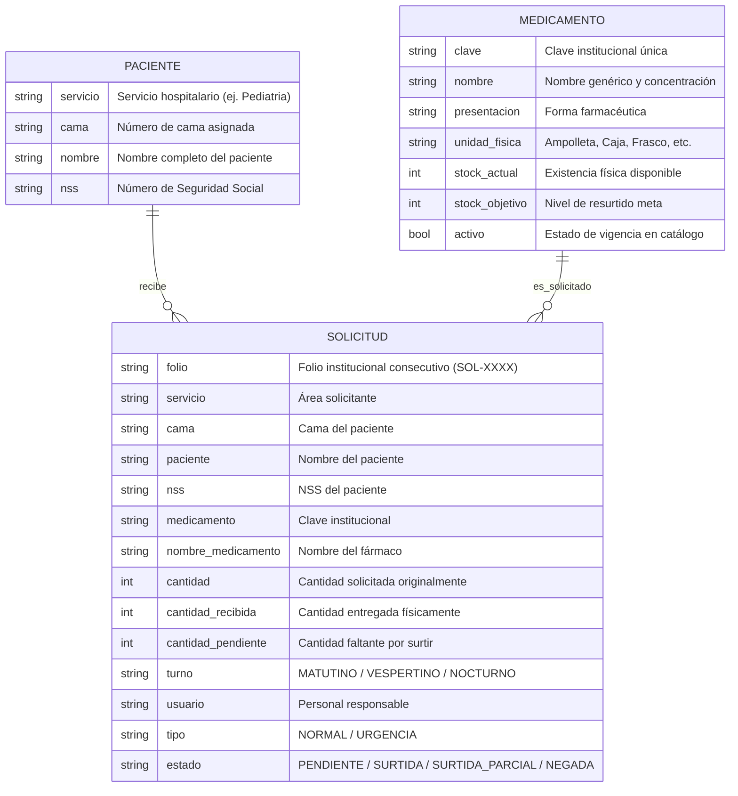

# SMART CENDIS 🏥💊

> **Sistema de Gestión Digital de Solicitudes, Abastecimiento y Control de Inventario Hospitalario**

[](https://www.python.org/)
[](LICENSE)
[]()
[]()

---

## 📋 Descripción General

**SMART CENDIS** es una solución integral diseñada para optimizar, estandarizar y auditar el flujo de solicitudes, surtimiento y recepción física de medicamentos e insumos entre los servicios hospitalarios (Pediatría, Urgencias, Medicina Interna, Cirugía) y el **CENDIS** (Centro de Distribución / Farmacia Central).

El sistema elimina las discrepancias habituales en el abasto intrahospitalario garantizando:
- **Trazabilidad de extremo a extremo** vinculando cada solicitud con paciente, cama, Número de Seguridad Social (NSS), turno y personal responsable.
- **Auditoría de recepción física**, permitiendo detectar surtidos parciales o negados y actualizando el stock disponible de forma instantánea.
- **Control proactivo de niveles de stock** frente a metas institucionales (Stock Objetivo vs. Stock Actual).
- **Persistencia atómica y resiliente** que previene la pérdida o corrupción de datos ante apagones o fallos de ejecución.

---

## 🔄 Flujo del Ciclo de Abastecimiento


---

## 🗄️ Modelo de Datos y Entidades



---

## 🚀 Características Principales

### 1. Gestión de Medicamentos
- Registro con validación de clave única institucional.
- Búsqueda flexible por texto parcial (el usuario no requiere memorizar claves numéricas).
- Modificación de nombres y metas de stock.
- Desactivación lógica (baja lógica): preserva el historial de consumos sin ofertar medicamentos descontinuados.

### 2. Gestión de Pacientes y Camas
- Localización rápida por combinación de Servicio y Cama.
- Asociación inequívoca con el NSS del paciente hospitalizado.

### 3. Solicitudes y Priorización
- Folios correlativos autoincrementables con formato estandarizado `SOL-XXXX`.
- Clasificación de requerimientos en **NORMAL** y **URGENCIA**.
- Trazabilidad por turno (Matutino, Vespertino, Nocturno) y firma de usuario responsable.

### 4. Dictamen de Farmacia y Recepción Física
- Dictamen de Farmacia Central: `SURTIDA` o `NEGADA`.
- Recepción física en piso con validación de cantidades (no se permite recibir cantidades negativas o superiores a la solicitada).
- Cálculo automático de faltantes y derivación a estados finales: `SURTIDA`, `SURTIDA_PARCIAL` o `NEGADA`.
- Actualización inmediata del inventario en piso.

### 5. Monitoreo de Inventario y Faltantes
- Comparativa visual entre `Stock Actual` y `Stock Objetivo`.
- Detección automática del volumen faltante para reabastecimiento programado.

### 6. Persistencia Atómica
- Almacenamiento seguro en archivo `smart_cendis.json`.
- Escritura atómica a través de archivos temporales (`.tmp`) y reemplazo atómico a nivel del sistema operativo (`os.replace`), garantizando integridad referencial y evitando archivos corruptos por desconexiones o interrupciones.

---

## 📂 Estructura del Proyecto

```text
SMART-CENDIS/
├── smart_cendis.py              # Aplicación principal e interfaz interactiva CLI
├── tests/
│   └── test_smart_cendis.py     # Suite de 12 pruebas unitarias automatizadas
├── .gitignore                   # Exclusiones de persistencia local y artefactos Python
├── LICENSE                      # Licencia de código abierto MIT
└── README.md                    # Documentación técnica completa del sistema
```

---

## 💻 Requisitos y Prerrequisitos

- **Python 3.8 o superior**.
- No requiere dependencias externas obligatorias (**Baterías incluidas** con la biblioteca estándar de Python: `json`, `os`, `tempfile`, `unittest`).

---

## 🛠️ Instalación y Puesta en Marcha

1. **Clonar el repositorio:**
   ```bash
   git clone https://github.com/AlexSc97/SMART-CENDIS.git
   cd SMART-CENDIS
   ```

2. **Ejecutar la aplicación:**
   ```bash
   python smart_cendis.py
   ```

---

## 📖 Menú de Operación

Al ejecutar el programa se despliega la interfaz interactiva de consola:

```text
=======================================================
                    SMART CENDIS
=======================================================
   Sistema de Gestión Digital de Solicitudes,
     Abastecimiento y Control de Inventario
=======================================================
 1. Registrar medicamento en catálogo
 2. Consultar catálogo de medicamentos
 3. Modificar datos de medicamento
 4. Desactivar medicamento (baja lógica)
 5. Consultar datos de paciente por servicio/cama
 6. Registrar nueva solicitud de medicamento
 7. Procesar solicitud en farmacia (Surtida / Negada)
 8. Registrar recepción física y actualizar stock
 9. Consultar historial de solicitudes
10. Consultar inventario y niveles de stock
11. Limpiar historial de solicitudes
 0. Salir
=======================================================
```

---

---

## 🌐 Plataforma Web Interactiva (SPA)

Para una experiencia visual académica y moderna, el sistema incluye una aplicación web de una sola página (**Single Page Application**):
- **Archivo principal:** [`index.html`](index.html) (o [`smartcendis_web.html`](smartcendis_web.html)).
- **Dashboard en tiempo real:** KPIs de inventario, alertas de stock bajo (<30%), estado de solicitudes y métricas de dispensación.
- **Módulos completos:** Catálogo de medicamentos, censo de pacientes, solicitudes con validación regex en cliente, procesamiento de farmacia y recepción física en piso.
- **Persistencia local:** Utiliza `localStorage` sincronizado y reactivo.

Para visualizarla, basta con abrir `index.html` en cualquier navegador web moderno.

---

## 🚀 SMART CENDIS v3 (Etapa 3 - Auditoría y Robustez)

El script [`smartCendis_v3.py`](smartCendis_v3.py) implementa todas las observaciones técnicas y de rúbrica de la Etapa 3:
1. **Validación Exhaustiva con Expresiones Regulares (`[REG-01]`):**
   - 16 patrones compilados (`RE_MENU`, `RE_CLAVE_MED`, `RE_NOMBRE_MED`, `RE_FOLIO`, etc.) con validación estricta vía `re.fullmatch()`.
2. **Persistencia Atómica con Rollback (`[PER-01]`):**
   - Verificación del estado de retorno en `guardar_datos()` y reversión de cambios en memoria si la escritura en disco falla.
3. **Validación y Coherencia de Esquema (`[PER-02]`):**
   - Detección de estados y cantidades inconsistentes en JSON y corrección automática de desfases en el contador de folios.
4. **Normalización de Entradas (`[VAL-01]`, `[VAL-02]`):**
   - Eliminación de espacios, normalización mayúsculas/minúsculas y soporte de folios ilimitados `SOL-XXXX`.

---

## 🧪 Pruebas Unitarias y Automatizadas

El proyecto cuenta con múltiples suites de validación y aseguramiento de calidad:

### 1. Suite de Pruebas Unitarias (Estándar):
```bash
python -m unittest discover -s tests
```
*12 pruebas unitarias de lógica central de persistencia y operaciones.*

### 2. Suite Automatizada Etapa 3 (44 Casos):
```bash
python test_smartCendis_v3.py
```
- **Grupo A (14 casos):** Validaciones de formato con expresiones regulares.
- **Grupo B (19 casos):** Regresión de flujo funcional completo (Solicitud → Surtido → Recepción).
- **Grupo C (6 casos):** Robustez ante JSON corrupto, stock negativo y reversión.
- **Grupo D (5 casos):** Coherencia de folios y contador.

### 3. Ejecutor con Generación de Evidencias y Capturas:
```bash
python run_tests.py
python capturar_evidencias.py
```
- Reportes textuales guardados en [`evidencias/`](evidencias/).
- Capturas de terminal renderizadas en alta resolución en [`capturas reales/`](capturas%20reales/).

---

## 📄 Licencia

Este proyecto está bajo la Licencia **MIT**. Consulta el archivo [LICENSE](LICENSE) para más información.

---

## 👨‍💻 Autor

Desarrollado y mantenido por **[AlexSc97](https://github.com/AlexSc97)**.
