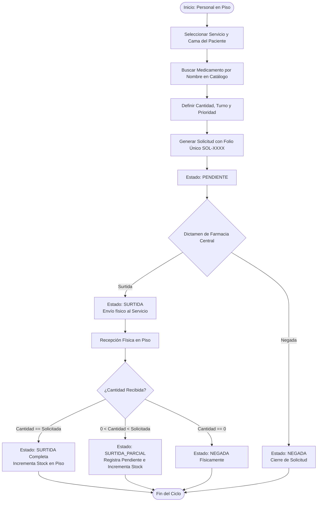
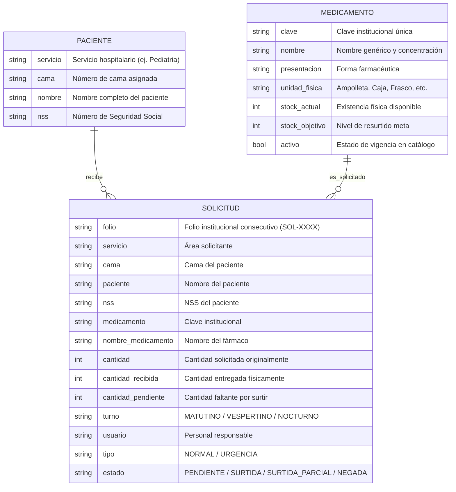

# SMART CENDIS 🏥💊

> **Sistema de Gestión Digital de Solicitudes, Abastecimiento y Control de Inventario Hospitalario**

[](https://www.python.org/)
[](LICENSE)
[]()
[]()

---

## 📋 Descripción General

**SMART CENDIS** es una solución integral diseñada para optimizar, estandarizar y auditar el flujo de solicitudes, surtimiento y recepción física de medicamentos e insumos entre los servicios hospitalarios (Pediatría, Urgencias, Medicina Interna, Cirugía) y el **CENDIS** (Centro de Distribución / Farmacia Central).

El sistema elimina las discrepancias habituales en el abasto intrahospitalario garantizando:
- **Trazabilidad de extremo a extremo** vinculando cada solicitud con paciente, cama, Número de Seguridad Social (NSS), turno y personal responsable.
- **Auditoría de recepción física**, permitiendo detectar surtidos parciales o negados y actualizando el stock disponible de forma instantánea.
- **Control proactivo de niveles de stock** frente a metas institucionales (Stock Objetivo vs. Stock Actual).
- **Persistencia atómica y resiliente** que previene la pérdida o corrupción de datos ante apagones o fallos de ejecución.

---

## 🔄 Flujo del Ciclo de Abastecimiento



---

## 🗄️ Modelo de Datos y Entidades



---

## 🚀 Características Principales

### 1. Gestión de Medicamentos
- Registro con validación de clave única institucional.
- Búsqueda flexible por texto parcial (el usuario no requiere memorizar claves numéricas).
- Modificación de nombres y metas de stock.
- Desactivación lógica (baja lógica): preserva el historial de consumos sin ofertar medicamentos descontinuados.

### 2. Gestión de Pacientes y Camas
- Localización rápida por combinación de Servicio y Cama.
- Asociación inequívoca con el NSS del paciente hospitalizado.

### 3. Solicitudes y Priorización
- Folios correlativos autoincrementables con formato estandarizado `SOL-XXXX`.
- Clasificación de requerimientos en **NORMAL** y **URGENCIA**.
- Trazabilidad por turno (Matutino, Vespertino, Nocturno) y firma de usuario responsable.

### 4. Dictamen de Farmacia y Recepción Física
- Dictamen de Farmacia Central: `SURTIDA` o `NEGADA`.
- Recepción física en piso con validación de cantidades (no se permite recibir cantidades negativas o superiores a la solicitada).
- Cálculo automático de faltantes y derivación a estados finales: `SURTIDA`, `SURTIDA_PARCIAL` o `NEGADA`.
- Actualización inmediata del inventario en piso.

### 5. Monitoreo de Inventario y Faltantes
- Comparativa visual entre `Stock Actual` y `Stock Objetivo`.
- Detección automática del volumen faltante para reabastecimiento programado.

### 6. Persistencia Atómica
- Almacenamiento seguro en archivo `smart_cendis.json`.
- Escritura atómica a través de archivos temporales (`.tmp`) y reemplazo atómico a nivel del sistema operativo (`os.replace`), garantizando integridad referencial y evitando archivos corruptos por desconexiones o interrupciones.

---

## 📂 Estructura del Proyecto

```text
SMART-CENDIS/
├── smart_cendis.py              # Aplicación principal e interfaz interactiva CLI
├── tests/
│   └── test_smart_cendis.py     # Suite de 12 pruebas unitarias automatizadas
├── .gitignore                   # Exclusiones de persistencia local y artefactos Python
├── LICENSE                      # Licencia de código abierto MIT
└── README.md                    # Documentación técnica completa del sistema
```

---

## 💻 Requisitos y Prerrequisitos

- **Python 3.8 o superior**.
- No requiere dependencias externas obligatorias (**Baterías incluidas** con la biblioteca estándar de Python: `json`, `os`, `tempfile`, `unittest`).

---

## 🛠️ Instalación y Puesta en Marcha

1. **Clonar el repositorio:**
   ```bash
   git clone https://github.com/AlexSc97/SMART-CENDIS.git
   cd SMART-CENDIS
   ```

2. **Ejecutar la aplicación:**
   ```bash
   python smart_cendis.py
   ```

---

## 📖 Menú de Operación

Al ejecutar el programa se despliega la interfaz interactiva de consola:

```text
=======================================================
                    SMART CENDIS
=======================================================
   Sistema de Gestión Digital de Solicitudes,
     Abastecimiento y Control de Inventario
=======================================================
 1. Registrar medicamento en catálogo
 2. Consultar catálogo de medicamentos
 3. Modificar datos de medicamento
 4. Desactivar medicamento (baja lógica)
 5. Consultar datos de paciente por servicio/cama
 6. Registrar nueva solicitud de medicamento
 7. Procesar solicitud en farmacia (Surtida / Negada)
 8. Registrar recepción física y actualizar stock
 9. Consultar historial de solicitudes
10. Consultar inventario y niveles de stock
11. Limpiar historial de solicitudes
 0. Salir
=======================================================
```

---

## 🧪 Pruebas Unitarias Automatizadas

El proyecto incluye una suite completa de pruebas unitarias que validan la lógica de negocio, validaciones de entrada, cálculos de stock y persistencia en disco:

Para ejecutar todas las pruebas automatizadas:

```bash
python -m unittest discover -s tests
```

### Cobertura de las pruebas:
- `test_buscar_medicamento_existente`: Localización por clave institucional.
- `test_buscar_medicamento_inexistente`: Manejo de claves no registradas.
- `test_registrar_medicamento_exitoso`: Alta de nuevo fármaco en catálogo.
- `test_registrar_medicamento_clave_duplicada`: Prevención de duplicados.
- `test_modificar_medicamento_exitoso`: Actualización de stock objetivo y nombre.
- `test_eliminar_medicamento_logico`: Verificación de baja lógica (`activo = False`).
- `test_buscar_paciente_existente`: Búsqueda insensible a mayúsculas/minúsculas.
- `test_buscar_paciente_inexistente`: Validación de servicio y cama sin paciente.
- `test_registrar_solicitud_exitosa`: Registro y cálculo de cantidades iniciales.
- `test_procesar_solicitud_surtida_farmacia`: Cambio de estado en Farmacia.
- `test_registrar_recepcion_parcial`: Actualización de stock y estado `SURTIDA_PARCIAL`.
- `test_guardar_y_cargar_datos`: Prueba de serialización y deserialización JSON atómica.

---

## 📄 Licencia

Este proyecto está bajo la Licencia **MIT**. Consulta el archivo [LICENSE](LICENSE) para más información.

---

## 👨‍💻 Autor

Desarrollado y mantenido por **[AlexSc97](https://github.com/AlexSc97)**.
